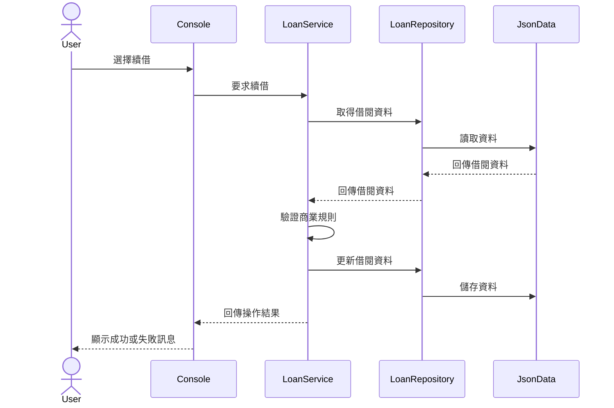

# Lab：GitHub Copilot 實戰開發

## 使用 Copilot 接手既有專案並完成跨檔案功能

> Repository：
<https://github.com/AndyHuang1223/AccelerateDevGitHubCopilot>

> 本文件是課程操作手冊，不是系統架構文件。初始 Repository 不包含 README、Repository Overview 或 Create Loan 設計文件；學員會在 Lab 過程中建立這些成果。


---

## Lab 簡介

在真實的軟體開發工作中，開發者通常不會從空白專案開始。

更多時候，我們需要：

* 接手既有 Repository
* 理解陌生的系統架構
* 確認需求所需要的基礎功能是否已經存在
* 找出現有功能的執行流程
* 分析需求可能影響的範圍
* 設計新的商業流程
* 修改多個 Project 與檔案
* 補上單元測試
* 執行建置與驗證
* 進行 Code Review
* 更新文件並交付成果

本 Lab 將使用一套既有的圖書館管理系統，帶領你使用 GitHub Copilot 完成一條完整的 AI 輔助開發流程。

```text
取得專案
    ↓
建立 Baseline
    ↓
理解 Repository
    ↓
盤點既有功能
    ↓
驗證需求前提
    ↓
建立 Context
    ↓
分析需求與缺口
    ↓
規劃修改
    ↓
局部重構
    ↓
跨檔案實作
    ↓
建立測試
    ↓
建置與驗證
    ↓
Code Review
    ↓
更新文件
```


---

## 學習目標

完成本 Lab 後，你將能夠：


 1. 使用 GitHub Copilot 分析陌生 Repository。
 2. 區分「文件描述的功能」與「程式碼實際存在的功能」。
 3. 驗證新需求所依賴的基礎流程是否已經存在。
 4. 使用 Context 提高 Copilot 回答的準確性。
 5. 使用結構化 Prompt 描述跨檔案開發任務。
 6. 根據工作類型選擇 Ask、Plan、Edit 或 Agent。
 7. 使用 Copilot 追蹤既有功能的執行流程。
 8. 使用 Copilot 找出需求與現況之間的缺口。
 9. 使用 Edit 進行範圍明確的程式碼修改。
10. 使用 Agent 執行跨檔案功能開發。
11. 使用 Copilot 建立與補強單元測試。
12. 使用 Copilot 進行 Code Review。
13. 在採用 AI 產生的程式碼前完成必要驗證。


---

## Lab 情境

你剛加入一個負責維護圖書館管理系統的團隊。

團隊交給你一套既有的 C#／.NET 專案，但目前沒有完整的系統說明文件。

從目前程式碼可以觀察到，系統已經具備部分圖書館管理能力，例如：

* 搜尋讀者
* 查看讀者資料
* 查看讀者借閱紀錄
* 查看單筆借閱明細
* 歸還借閱
* 續借
* 會員續期
* 使用 JSON 儲存部分資料

但是，團隊希望加入一項目前尚未完整實作的新功能。

### 新功能需求

> 圖書館人員可以為讀者建立新的借閱紀錄。
每位讀者最多只能同時借閱 5 本尚未歸還的書籍。
當讀者已達借閱上限時，系統必須拒絕新的借閱操作，並顯示清楚的錯誤訊息。

這項需求可能不只是增加一個條件判斷。

在實作前，必須先確認目前 Repository 是否已具備：

* 新增借閱的 Console 操作
* 選擇館藏的流程
* 建立 Loan 的 Application Service
* 新增 Loan 的 Repository 方法
* 判斷館藏是否可借的方式
* 產生新 Loan 識別值的方式
* 將新增資料寫回 JSON 的能力
* 防止同一本館藏被重複借出的規則

如果這些能力不存在，就必須把它們納入實作範圍。


---

## 功能驗收條件

完成後，系統至少需要符合以下條件。

### 新增借閱


1. 使用者可以選擇一位讀者。
2. 使用者可以選擇一筆可借閱的館藏。
3. 系統可以建立新的借閱紀錄。
4. 新借閱紀錄包含必要的借閱資訊。
5. 新增借閱後，資料可以被儲存。
6. 已經借出的館藏不能被重複借出。

### 借閱上限


1. 讀者有 0 至 4 本未歸還書籍時，可以繼續借閱。
2. 讀者目前有 4 本未歸還書籍時，可以借第 5 本。
3. 讀者目前有 5 本未歸還書籍時，第 6 本必須被拒絕。
4. 已歸還的借閱紀錄不計入借閱上限。
5. 借閱被拒絕時，不得建立新的借閱紀錄。
6. 借閱被拒絕時，不得留下部分更新的資料。
7. Console 必須顯示清楚且一致的失敗原因。

### 架構限制

* 沿用目前 Solution 與 Project 分層。
* 商業規則應位於 ApplicationCore。
* Console 只負責輸入、輸出與流程協調。
* Console 不可自行計算未歸還借閱數量。
* Infrastructure 不可決定借閱上限。
* 優先沿用既有 Entity、Service、Interface 與結果回傳方式。
* 不新增不必要的第三方套件。
* 不修改與需求無關的功能。
* 不可刪除既有測試。
* 原有測試必須繼續通過。


---

## 前置需求

開始前請確認已安裝：

* Git
* Visual Studio Code
* GitHub Copilot
* GitHub Copilot Chat
* .NET SDK 8
* 可使用 GitHub Copilot 的 GitHub 帳號

### 確認 Git

```bash
git --version
```

### 確認 .NET SDK

```bash
dotnet --info
```

本專案使用 .NET 8；Repository 中的 `global.json` 會限制 SDK 使用 .NET 8 feature band。`dotnet --info` 顯示的 SDK 應為 8.x。

### 確認 VS Code

```bash
code --version
```


---

## Part 1：取得並執行專案

### Step 1：Clone Repository

```bash
git clone https://github.com/AndyHuang1223/AccelerateDevGitHubCopilot.git
cd AccelerateDevGitHubCopilot
```

使用 VS Code 開啟專案：

```bash
code .
```

### Step 2：建立 Lab 分支

請不要直接在 `main` 分支上操作。

```bash
git checkout -b lab/copilot-create-loan
```

確認目前分支：

```bash
git branch --show-current
```

預期結果：

```text
lab/copilot-create-loan
```

### Step 3：確認 Solution 結構

```bash
dotnet sln list
```

觀察 Solution 中包含哪些 Project。

也可以依作業系統搜尋 `.csproj`。

#### macOS／Linux

```bash
find src tests -name "*.csproj"
```

#### PowerShell

```powershell
Get-ChildItem -Path src,tests -Filter *.csproj -Recurse
```

### Step 4：還原相依套件

```bash
dotnet restore
```

### Step 5：建置 Solution

```bash
dotnet build
```

請確認建置結果中沒有錯誤。

目前 baseline 可能保留既有 warnings；本步驟以 0 個 build error 為必要條件。Warnings 請記錄，但不要為了通過 Lab 先行清理。

### 檢查點

- [ ] Repository 已成功 Clone
- [ ] 已建立自己的 Lab 分支
- [ ] 已確認 Solution 中的 Project
- [ ] `dotnet restore` 成功
- [ ] `dotnet build` 成功


---

## Part 2：建立修改前 Baseline

在修改任何程式碼前，先建立目前專案的 Baseline。

### Step 0：重設 Lab runtime data

先建立乾淨、可重複的執行資料：

```bash
dotnet run --project src/Library.Console/Library.Console.csproj -- --reset-data
```

Console 啟動時會顯示實際資料目錄，預設是 Repository root 的 `.library-data`。`src/Library.Console/Json` 是 Git 追蹤的唯讀 seed；Console 實際讀寫的是 `.library-data` 中的副本。`appSettings.json` 的 `JsonData.RuntimeRoot` 設定 runtime root，`JsonData.ReferenceDate` 用來將 seed 日期整批位移到執行當天附近。`.library-data/` 已被 Git 忽略，不應手動加入 Commit。

若資料目錄只剩部分 JSON，程式會停止並提示重新執行 `--reset-data`，不會自行覆寫殘留資料。之後每次要重現邊界案例或清除前一個案例的影響，都使用 `--reset-data`，不要用 `git restore` 復原 seed。

### Step 1：執行既有測試

```bash
dotnet test
```

記錄目前測試結果：

```text
測試總數：
成功：
失敗：
略過：
```

> 在修改程式碼前執行既有測試，可以建立修改前的 Baseline。
如果一開始就有測試失敗，後續必須區分是既有問題，還是本次修改造成的 Regression。

目前版本的 baseline 預期為 23 個測試全部通過；若你的環境結果不同，請先記錄 SDK、命令與完整輸出。

### Step 2：執行 Console Application

```bash
dotnet run --project src/Library.Console/Library.Console.csproj
```

若不知道目前 runtime data 是否已被前一個案例修改，請先離開 Console，再重新執行 `--reset-data`。

請操作一次既有功能，觀察：

* 使用者如何搜尋讀者
* 使用者如何選擇讀者
* 系統如何顯示讀者資料
* 系統如何顯示借閱清單
* 使用者如何選擇一筆借閱紀錄
* 續借成功或失敗時顯示什麼
* 歸還成功或失敗時顯示什麼
* 會員續期成功或失敗時顯示什麼
* 修改後的資料是否會寫回 JSON
* 目前選單是否有「新增借閱」操作

### Step 3：記錄現有功能

| 功能  | 是否存在 | 操作方式 | 備註  |
|-----|------|------|-----|
| 搜尋讀者 |      |      |     |
| 查看讀者資料 |      |      |     |
| 查看借閱清單 |      |      |     |
| 查看借閱明細 |      |      |     |
| 歸還借閱 |      |      |     |
| 續借  |      |      |     |
| 會員續期 |      |      |     |
| 新增借閱 |      |      |     |
| 新增讀者 |      |      |     |
| 新增書籍 |      |      |     |

### Baseline 教學資料

重設後可用以下固定情境驗證既有功能與後續新增借閱：

| 讀者 | 初始情境 |
|---|---|
| Patron 1 | 0 筆進行中借閱 |
| Patron 2 | 4 筆進行中借閱 |
| Patron 3 | 5 筆進行中借閱 |
| Patron 4 | 4 筆進行中借閱、1 筆已歸還 |
| Patron 5 | 有逾期未歸還借閱，會員接近到期 |
| Patron 6 | 會員有效、借閱未逾期 |
| Patron 7 | 會員過期、借閱未逾期 |
| Patron 8 | 會員有效、借閱逾期 |
| Patron 9 | 借閱已歸還 |
| Patron 10 | 會員一個月內到期且沒有逾期借閱 |

初始可借館藏為 BookItem 14、19、20；BookItem 1 已有進行中借閱。完成搜尋、明細、續借、歸還與會員續期的探索後，再執行一次 `--reset-data`，讓下一個 Part 從相同資料開始。

### 檢查點

- [ ] 已執行修改前測試
- [ ] 已記錄測試 Baseline
- [ ] 已執行 Console Application
- [ ] 已實際操作既有功能
- [ ] 已確認目前是否存在新增借閱功能


---

## Part 3：使用 Ask 理解 Repository

### 為什麼先理解再修改？

面對陌生 Repository 時，直接要求 Copilot「新增功能」容易發生：

* 修改錯誤的檔案
* 將商業邏輯放錯層
* 重複建立既有功能
* 忽略既有命名與設計方式
* 把更新既有資料誤認為建立新資料
* 根據 README 猜測不存在的功能
* 破壞原有行為
* 建立與專案風格不一致的測試

因此，第一步應該先使用 Ask 模式理解專案。

### Step 1：分析整個 Repository

開啟 GitHub Copilot Chat，切換到適合分析與問答的模式。

輸入：

```text
請分析目前整個 Repository。

先不要修改任何程式碼，也不要執行會改變檔案的命令。

請說明：

1. 這個系統的主要用途
2. Solution 中包含哪些 Project
3. 每個 Project 的主要責任
4. Project 之間的依賴方向
5. 主要的領域物件
6. 目前實際存在的圖書館功能
7. 讀者查詢的主要執行流程
8. 續借的主要執行流程
9. 歸還的主要執行流程
10. 會員續期的主要執行流程
11. 資料從哪裡載入與儲存
12. Console Application 如何呼叫核心商業邏輯
13. 單元測試目前涵蓋哪些功能
14. GitHub Actions 執行哪些驗證
15. 新加入的開發者應該先閱讀哪些檔案
16. Repository root 是否已有 README、`docs/repository-overview.md` 或 `docs/create-loan-design.md`；請將本手冊 `docs/lab-github-copilot.md` 視為課程文件，不要當成系統說明文件
17. `global.json` 固定的 .NET SDK 版本與目前測試總數
18. `JsonData.InitializeAsync` 如何區分 tracked seed 與 runtime data，以及實際 runtime root
19. Infrastructure 測試涵蓋哪些初始化、reset 與資料一致性情境

請標示每項判斷所依據的檔案與方法。

如果有無法從程式碼確認的內容，請明確標記為「無法確認」。
不要根據 README 或命名自行假設功能已經實作。
```

本 Lab 手冊本身不是系統 README，也不是 Repository 功能證據；請只根據實際檔案與方法回答。初始 Repository 沒有要先交付的 README 或設計文件，這些文件會在後續 Part 由學員建立。

### Step 2：驗證 Copilot 的回答

不要直接相信 Copilot 的分析。

請手動確認：

* Solution 中的 Project 名稱是否正確
* Project Reference 是否符合 Copilot 的說明
* Copilot 提到的檔案是否真的存在
* Entity、Service、Interface 名稱是否正確
* 續借與歸還流程是否能在程式碼中追蹤
* Repository 是否只有查詢與更新能力
* 測試專案是否真的測試 Copilot 所說的功能
* GitHub Actions 是否真的執行 Copilot 所說的命令
* Copilot 是否將「續借」誤認為「新增借閱」
* Copilot 是否把 `UpdateLoan` 誤認為新增 Loan

### 驗證紀錄

| Copilot 的說明 | 驗證檔案 | 正確與否 | 備註  |
|-------------|------|------|-----|
|             |      |      |     |
|             |      |      |     |
|             |      |      |     |
|             |      |      |     |

### Step 3：建立 Repository Overview

在 Repository 中建立：

```text
docs/repository-overview.md
```

可先詢問 Copilot：

```text
請根據剛才已驗證的 Repository 分析結果，
產生 docs/repository-overview.md 的初稿。

文件至少包含：

- 系統用途
- Solution 結構
- 每個 Project 的責任
- Project 依賴方向
- 核心領域物件
- 目前已實作功能
- 讀者查詢流程
- 續借流程
- 歸還流程
- 會員續期流程
- 資料存取方式
- Console 操作流程
- 測試結構
- CI 流程
- 目前不存在的功能
- 尚待確認事項

只根據 Repository 中可以確認的內容撰寫。

不要將規劃中的功能寫成已經完成。
不要加入不存在的 Web API、Controller、資料庫或前端。
```

建立文件後，手動檢查並修正錯誤。

### 檢查點

- [ ] 能說明每個 Project 的責任
- [ ] 能說明 Project 依賴方向
- [ ] 能指出續借功能的主要檔案
- [ ] 能指出歸還功能的主要檔案
- [ ] 能說明資料如何載入與儲存
- [ ] 已建立 `repository-overview.md`
- [ ] 已驗證 Copilot 的分析結果


---

## Part 4：驗證需求的既有基礎

### 實驗目的

在規劃新功能前，先確認需求所依賴的基礎能力是否存在。

這一步的目的不是立即產生程式碼，而是回答：

> 目前的 Repository 是否已經有完整的新增借閱流程？

### Step 1：要求 Copilot 進行可行性分析

使用 Ask：

```text
我們準備加入以下需求：

「圖書館人員可以為讀者建立新的借閱紀錄，
且每位讀者最多只能同時借閱 5 本尚未歸還的書籍。」

在規劃實作前，請先確認目前 Repository 是否具備完成此需求所需要的基礎能力。

請檢查：

1. 是否有新增借閱的 Console 操作
2. 是否有選擇書籍或館藏的流程
3. 是否有搜尋可借館藏的流程
4. 是否有判斷館藏可借狀態的邏輯
5. 是否有建立 Loan 的 Application Service
6. 是否有新增 Loan 的 Repository 方法
7. 是否有產生新 Loan ID 的方式
8. 是否能將新增 Loan 寫回 JSON
9. 是否會同步維護 BookItem 或館藏狀態
10. 是否有新增借閱相關的單元測試
11. `src/Library.Console/Json` seed 與 `.library-data` runtime data 的資料流
12. `JsonData.InitializeAsync` 的初始化、日期位移、reset 與 partial dataset 行為
13. `tests/UnitTests/Infrastructure/JsonDataTests.cs` 涵蓋的 baseline 測試

請將結論分成：

- 已存在，可直接沿用
- 部分存在，需要擴充
- 完全不存在，需要新增
- 無法從 Repository 確認

每項結論都要附上檔案與方法依據。

不要修改程式碼。
不要將續借、歸還、UpdateLoan 或修改 DueDate 視為新增借閱。
不要因為 README 描述某項功能，就假設程式碼已經實作。
```

### Step 2：建立能力缺口表

| 所需能力 | 現況  | 證據檔案 | 建議處理方式 |
|------|-----|------|--------|
| 新增借閱 Console 操作 |     |      |        |
| 選擇館藏 |     |      |        |
| 判斷館藏可借狀態 |     |      |        |
| 建立 Loan Service |     |      |        |
| 新增 Loan Repository 方法 |     |      |        |
| 產生 Loan ID |     |      |        |
| 寫回 JSON |     |      |        |
| 防止重複借出 |     |      |        |
| 借閱上限規則 |     |      |        |
| 單元測試基礎 |     |      |        |

目前 Repository 已具備既有借閱的查詢、續借、歸還與 JSON 更新能力，但尚未提供新增借閱的 Console 操作、CreateLoan Service、BookItem Repository 或新增 Loan 寫入流程。請將「可以更新既有 Loan」與「可以建立新 Loan」分開記錄。

### Step 3：辨識 Copilot 的假設

檢查 Copilot 是否出現以下問題：

* 把 `ExtendLoan` 當成新增借閱
* 把 `UpdateLoan` 當成新增 Loan
* 假設存在 `BorrowBook` 或 `CreateLoan`
* 假設有資料庫 Transaction
* 假設有 Web API
* 假設 BookItem 一定有可借狀態欄位
* 假設 ID 可以直接自動遞增
* 假設 JSON 儲存新增資料不需要修改
* 假設現有 Console 已經能選書

### 檢查點

- [ ] 已確認新增借閱流程是否存在
- [ ] 已列出需求所需的能力缺口
- [ ] 每項結論都有程式碼依據
- [ ] 已找出 Copilot 可能產生的錯誤假設
- [ ] 尚未開始修改程式碼


---

## Part 5：追蹤既有流程

新增功能前，先追蹤一條目前實際存在的流程，理解專案的設計方式。

本 Lab 建議追蹤「續借流程」。

### Step 1：從 Console 追蹤到商業邏輯

使用 Ask：

```text
請追蹤目前系統中的續借流程。

從使用者在 Console 中選擇一筆借閱紀錄並執行續借開始，
一直追蹤到 DueDate 更新並儲存回 JSON 為止。

請依照實際呼叫順序列出：

1. Console 畫面或狀態
2. Console 中執行的方法
3. 傳入的參數
4. 使用的 Interface
5. ApplicationCore 中的 Service
6. Service 中的商業規則
7. 使用的 Entity
8. Repository 介面
9. Infrastructure 實作
10. JSON 資料更新位置
11. 成功結果如何回到 Console
12. 失敗結果如何回到 Console

每一個步驟都要附上檔案名稱與方法名稱。

不要修改程式碼。
不要加入 Repository 中不存在的 API、Controller 或資料庫。
如果無法確認某個步驟，請明確說明。
```

### Step 2：建立續借流程圖

請 Copilot 產生 Mermaid：

```text
請將目前實際存在的續借流程整理成 Mermaid sequenceDiagram。

參與者至少包含：

- User
- Console
- Loan Service
- Loan Repository
- JSON Data

只呈現 Repository 中實際存在的流程。

不要加入不存在的：

- Web API
- Controller
- HTTP Request
- Database
- Message Queue
```

將產生的 Mermaid 放入：

```text
docs/repository-overview.md
```

參考結構：



> 上述內容只是格式示意，必須依 Repository 實際程式碼修正。

請特別確認資料寫入位置：執行中的更新會寫入 Repository root 的 `.library-data/Loans.json`，不會直接改寫 tracked seed `src/Library.Console/Json/Loans.json`。Console 啟動時先執行 `JsonData.InitializeAsync`，再進入既有操作流程；reset 會重新建立 runtime 副本並套用 reference date 的日期位移。

### Step 3：分析現有架構慣例

```text
請根據續借、歸還與會員續期功能，
分析這個 Repository 實作商業操作時所使用的設計慣例。

請說明：

1. Console 如何觸發操作
2. Service 如何取得資料
3. 商業規則放在哪一層
4. Service 如何表示成功或失敗
5. Repository 如何更新資料
6. Infrastructure 如何儲存 JSON
7. Console 如何將結果轉成訊息
8. 單元測試如何測試 Service
9. 新增借閱功能可以沿用哪些模式
10. 哪些部分無法直接沿用

不要修改程式碼。
```


---

## Part 6：Context 管理實驗

### 實驗目的

比較不同 Context 對 Copilot 回答品質的影響。

請使用相同需求，依序執行三組 Prompt。

三組實驗全部使用 Copilot Ask／唯讀分析；不要切換到 Edit 或 Agent，也不要接受檔案修改。只記錄回答內容與假設的差異。


---

### 實驗 A：Context 不足

```text
請分析如何加入新增借閱功能與借閱上限。
先不要修改程式碼。
```

記錄結果：

```text
Copilot 做了哪些假設？

是否知道借閱上限是多少？

是否知道目前沒有新增借閱流程？

是否知道規則應該放在哪一層？

是否知道需要修改哪些檔案？

是否提到館藏可借狀態？

是否提到資料一致性？

是否提到測試？

是否可能修改錯誤的範圍？
```


---

### 實驗 B：加入部分 Context

```text
請閱讀目前與 Patron、Loan、BookItem、
Console 操作、Service、Repository 及 JSON 儲存有關的檔案。

分析要加入以下功能時可能需要修改哪些檔案：

- 使用者可以為讀者建立新的借閱紀錄
- 每位讀者最多同時借閱 5 本尚未歸還的書籍

先不要修改程式碼。
```


---

### 實驗 C：加入完整 Context

```text
請根據目前整個 Repository 的架構與程式碼風格，
分析如何加入以下需求。

功能需求：

1. 圖書館人員可以為讀者建立新的借閱紀錄
2. 每位讀者最多只能同時借閱 5 本尚未歸還的書籍

需求定義：

- 使用者必須先選擇讀者
- 使用者必須選擇一筆可借閱的館藏
- 系統必須建立新的 Loan 紀錄
- 只計算 ReturnDate 尚未設定的借閱紀錄
- 讀者目前有 4 本未歸還時，可以借第 5 本
- 讀者目前有 5 本未歸還時，不可借第 6 本
- 已歸還的借閱紀錄不計入上限
- 已被借出的館藏不可再次借出
- 拒絕借閱時，不可建立新的 Loan 紀錄
- 拒絕借閱時，不可留下部分更新的狀態

限制：

- 沿用目前 Project 分層
- 商業規則應位於 ApplicationCore
- Console 不可自行計算借閱數量
- Infrastructure 不可決定商業規則
- 不引入新的第三方套件
- 不修改無關功能
- 必須補上單元測試
- 原有測試必須繼續通過
- 不得假設目前已經有新增借閱流程
- 無法確認的設計不得自行決定

請先輸出：

1. 目前已具備的相關能力
2. 目前缺少的必要能力
3. 建議的新增借閱流程
4. 建議放置商業規則的位置
5. 預計修改或新增的檔案
6. 每個檔案的修改目的
7. 需要新增或修改的測試
8. 資料一致性風險
9. 尚未確定的設計事項

先不要修改程式碼。
```


---

### 比較結果

| 比較項目 | 實驗 A | 實驗 B | 實驗 C |
|------|------|------|------|
| 是否引用實際檔案 |      |      |      |
| 是否理解目前沒有新增借閱流程 |      |      |      |
| 是否理解架構 |      |      |      |
| 是否列出館藏狀態處理 |      |      |      |
| 是否列出測試 |      |      |      |
| 是否說明限制 |      |      |      |
| 是否考慮資料一致性 |      |      |      |
| 是否產生未驗證假設 |      |      |      |
| 回答是否可直接採用 |      |      |      |


---

## Part 7：使用結構化 Prompt 定義任務

本 Lab 使用以下 Prompt 結構：

```text
Goal
Context
Business Rules
Constraints
Output
Validation
Stop Conditions
```

### 結構化 Prompt 範例

```text
Goal：

在目前圖書館管理系統中加入完整的新增借閱流程，
並限制每位讀者最多同時借閱 5 本尚未歸還的書籍。

Context：

請先閱讀與以下內容有關的程式碼：

- Patron
- Loan
- Book
- BookItem
- Console 狀態與操作
- ApplicationCore Service
- Repository Interface
- JSON Infrastructure
- 單元測試
- 測試資料 Factory

請先確認目前不存在或不完整的新增借閱能力，
不要將續借或 UpdateLoan 視為新增借閱。

Business Rules：

- 使用者必須選擇一位讀者
- 使用者必須選擇一筆可借閱的館藏
- 已被借出且尚未歸還的館藏不可再次借出
- 每位讀者最多同時借閱 5 本尚未歸還的書籍
- 讀者有 0 至 4 本未歸還時可以借閱
- 第 5 本可以成功借閱
- 第 6 本必須被拒絕
- 已歸還的借閱紀錄不計入上限
- 拒絕時不可建立新的借閱紀錄
- 拒絕時不可留下部分更新的狀態

Fixed Design Decisions：

- `LoanDate` 使用 `DateTime.Now`。
- `DueDate` 為 `LoanDate.AddDays(14)`。
- `ReturnDate` 初始為 `null`。
- `JsonLoanRepository.AddLoan` 依目前最大 Loan ID + 1 產生新 ID。
- BookItem 可借狀態由是否存在相同 `BookItemId` 且 `ReturnDate == null` 的 Loan 推導；不新增或更新 BookItem 狀態欄位。
- 所有驗證完成後只執行一次新增／儲存；拒絕時不得修改 Loans 或其他資料。

Constraints：

- 沿用目前 Solution 與 Project 分層
- 商業規則必須位於 ApplicationCore
- Console 只負責輸入、輸出與流程協調
- Console 不可自行計算借閱數量
- Infrastructure 不可決定借閱上限
- 優先沿用既有 Service、Interface、Entity 與結果回傳模式
- 不新增第三方套件
- 不修改與需求無關的行為
- 不任意變更既有公開介面
- 沿用現有測試框架與命名方式
- 無法確認的設計不得自行假設

Output：

1. 說明目前已存在的相關能力
2. 說明目前缺少的能力
3. 說明建議的新借閱流程
4. 列出實作計畫
5. 列出預計修改或新增的檔案
6. 說明每個檔案的修改目的
7. 列出測試案例
8. 列出資料一致性風險
9. 列出固定設計以外尚待開發者確認的事項

本階段只建立計畫，
不要執行檔案修改或會改變 Repository 的終端機命令。

Validation：

- 執行 dotnet build
- 執行 dotnet test
- 驗證讀者可以建立新的借閱
- 驗證第 1 至第 5 本可以正常借閱
- 驗證第 6 本借閱被拒絕
- 驗證已歸還紀錄不計入上限
- 驗證已借出的館藏不能重複借出
- 驗證拒絕時不建立新借閱紀錄
- 驗證拒絕時沒有部分更新
- 確認原有測試仍然通過

Stop Conditions：

上述 Loan 欄位、ID、到期日與館藏可借判斷已由本 Lab 固定；若實際程式碼與此設計衝突，先列出證據並停止，不要自行改變規格。若遇到其他無法確認的資料一致性問題，列出問題、證據、選項與需確認事項，再等待開發者決定。

```


---

## Part 8：Ask、Plan、Edit、Agent 的分工

| 開發階段 | 建議模式 | 用途  |
|------|------|-----|
| 理解需求 | Ask  | 解釋、分析與釐清 |
| 理解 Repository | Ask  | 探索架構與執行流程 |
| 驗證需求前提 | Ask  | 確認基礎功能是否存在 |
| 評估修改範圍 | Ask／Plan | 找出檔案、缺口、風險與步驟 |
| 建立實作計畫 | Plan | 拆解跨檔案任務 |
| 修改局部程式碼 | Edit | 精準控制修改範圍 |
| 跨檔案實作 | Agent | 執行完整功能開發 |
| 分析錯誤 | Ask  | 解讀錯誤與判斷原因 |
| 修正明確錯誤 | Edit／Agent | 依修改範圍選擇模式 |
| 建立測試 | Edit／Agent | 依測試範圍選擇模式 |
| Code Review | Ask  | 找出問題、風險與遺漏 |
| 更新文件 | Edit／Agent | 更新 README 與技術文件 |


---

## Part 9：使用 Plan 規劃新增借閱功能

切換到 Plan 模式，輸入：

```text
請為以下需求建立實作計畫，但不要修改任何檔案。

需求：

在目前 Console 圖書館管理系統中加入新增借閱功能，
並限制每位讀者最多只能同時借閱 5 本尚未歸還的書籍。

驗收條件：

1. 使用者可以選擇一位讀者
2. 使用者可以選擇一筆可借閱的館藏
3. 系統可以建立新的 Loan 紀錄
4. 已借出的館藏不可重複借出
5. 讀者有 0 至 4 本未歸還書籍時，可以繼續借閱
6. 第 5 本可以成功借閱
7. 已有 5 本未歸還書籍時，第 6 本必須被拒絕
8. 已歸還的借閱紀錄不計入上限
9. 拒絕時不可建立新的借閱紀錄
10. 拒絕時不可留下部分更新
11. Console 必須顯示清楚的成功或失敗訊息
12. 原有測試必須繼續通過

架構限制：

- 商業規則位於 ApplicationCore
- Console 不可自行計算未歸還數量
- Infrastructure 不應決定商業規則
- 優先沿用既有 Service、Repository、Entity 與結果回傳模式
- 不新增第三方套件
- 不修改與需求無關的程式碼
- 不假設不存在的 API 或資料庫
- 不可將續借或 UpdateLoan 當成新增借閱

請輸出：

1. 現況分析
2. 已存在的相關能力
3. 缺少的必要能力
4. 建議的新增借閱流程
5. 修改策略
6. 依執行順序排列的修改步驟
7. 每一步涉及的檔案
8. 單元測試計畫
9. 整合驗證方式
10. 可能的資料一致性風險
11. 需要開發者確認的事項

以下設計已由本 Lab 固定，Plan 必須採用：

- `LoanDate = DateTime.Now`。
- `DueDate = LoanDate.AddDays(14)`，`ReturnDate = null`。
- `JsonLoanRepository.AddLoan` 依目前最大 Loan ID + 1 產生新 ID。
- BookItem 可借狀態由不存在相同 `BookItemId` 且 `ReturnDate == null` 的 Loan 推導，不新增或更新 BookItem 狀態欄位。
- 所有驗證完成後只執行一次 AddLoan／SaveLoans；失敗時不得修改資料。
```

### 檢查 Plan

- [ ] Plan 引用了實際存在的檔案
- [ ] Plan 沒有假設不存在的 Controller 或 API
- [ ] Plan 明確指出目前缺少新增借閱流程
- [ ] Plan 有包含 Service 層的新增借閱操作
- [ ] 商業規則放置位置合理
- [ ] Console 沒有承擔商業規則
- [ ] Infrastructure 沒有決定借閱資格
- [ ] 有考慮館藏重複借出
- [ ] 有考慮已歸還紀錄
- [ ] 有 4、5、6 的邊界值測試
- [ ] 有資料一致性驗證
- [ ] 有 Regression 驗證
- [ ] 沒有不必要的大範圍重構
- [ ] 已採用 Lab 固定的 Loan ID、14 天到期日、可借判斷與單次寫入設計
- [ ] 其他無法確認的資料一致性問題有列出證據與停手條件


---

## Part 10：建立設計決策紀錄

在 Agent 開始實作前，先記錄需求、現況與已確認的設計決策。

建立：

```text
docs/create-loan-design.md
```

建議至少包含：

```markdown
## Create Loan Design

### 需求摘要

### 現況

### 缺少的能力

### 新增借閱流程

### 商業規則

### ApplicationCore 設計

### Repository 設計

### Console 流程

### Loan ID 產生方式

### 借閱日期與到期日

### 館藏可借狀態判斷

### 資料一致性處理

### 結果狀態與錯誤訊息

### 測試策略

### 不在本次範圍內的功能

### 尚待確認事項
```

### 本 Lab 已固定的設計決策

設計文件必須明確記錄以下決策，不要把它們列為尚待確認：

- `LoanDate` 使用 `DateTime.Now`。
- `DueDate` 為 `LoanDate.AddDays(14)`；`ReturnDate` 初始為 `null`。
- `JsonLoanRepository.AddLoan` 依目前最大 Loan ID + 1 產生新 ID。
- BookItem 是否可借由不存在相同 `BookItemId` 且 `ReturnDate == null` 的 Loan 推導；不新增或更新 BookItem 狀態欄位。
- 所有驗證完成後只執行一次 AddLoan／SaveLoans；任何拒絕或例外都不得留下部分更新。

可使用以下 Prompt 產生初稿：

```text
請根據已確認的 Plan，
產生 docs/create-loan-design.md 的初稿。

只記錄目前已經確認的設計；本 Lab 已固定的設計決策必須照上述內容記錄。

如果某個設計仍未確認，請放在「尚待確認事項」，
不要自行選擇答案。

文件必須清楚區分：

- Repository 目前已存在的能力
- 本次需要新增的能力
- 本次不處理的功能
```


---

## Part 11：使用 Agent 實作新增借閱功能

確認 Plan 與設計決策後，切換到 Agent 模式。

```text
請依照已確認的 Plan 與 docs/create-loan-design.md，
在目前 Repository 中實作新增借閱功能與借閱上限。

功能需求：

1. 使用者可以從 Console 選擇一位讀者
2. 使用者可以選擇一筆可借閱的館藏
3. 系統可以建立新的 Loan 紀錄
4. 已借出的館藏不可重複借出
5. 每位讀者最多只能同時借閱 5 本尚未歸還的書籍
6. 讀者目前有 0 至 4 本未歸還書籍時，可以繼續借閱
7. 第 5 本可以成功借閱
8. 已有 5 本未歸還書籍時，第 6 本必須被拒絕
9. 已歸還的借閱紀錄不計入上限
10. 拒絕時不得建立新的借閱紀錄
11. 拒絕時不得留下部分更新
12. Console 必須顯示清楚且一致的成功或失敗訊息

架構限制：

- 沿用目前 ApplicationCore、Infrastructure 與 Console 的分層
- 商業規則必須位於 ApplicationCore
- Console 不可自行計算未歸還借閱數量
- Infrastructure 不可決定借閱上限
- 優先沿用既有 Service、Interface、Entity、Enum 與結果回傳方式
- 不新增第三方套件
- 不修改無關功能
- 不任意變更既有公開介面
- 沿用目前測試框架、Factory 與命名方式
- 不可刪除既有測試
- 不可為了讓測試通過而移除既有驗證
- 不可將續借、歸還或 UpdateLoan 視為新增借閱

執行流程：

1. 再次確認目前相關程式碼
2. 列出預計修改或新增的檔案
3. 依照已確認的設計逐步完成最小必要修改
4. 建立或擴充 ApplicationCore 的新增借閱操作
5. 建立必要的結果狀態
6. 擴充 Repository 與 JSON 儲存能力
7. 加入 Console 操作流程
8. 新增功能相關單元測試
9. 執行 dotnet build
10. 執行 dotnet test
11. 根據實際錯誤進行最小修正
12. 再次執行 build 與 test
13. 檢查 git diff
14. 提供最終修改摘要

停止條件：

Loan 欄位、ID、到期日、BookItem 可借判斷與單次寫入設計已由本 Lab 固定，必須依 `docs/create-loan-design.md` 實作。若實際程式碼與固定設計衝突，先停止並列出證據，不要自行改變規格。若遇到其他無法確認的資料一致性問題，請列出問題、程式碼位置、可行選項、風險與需要確認的事項。
```


---

## Part 12：檢查 Agent 的修改

Agent 完成後，不要只閱讀摘要。

執行：

```bash
git status
git diff --stat
git diff
git diff --check
```

`.library-data/` 是 ignored runtime data，可能因手動執行而改變；`src/Library.Console/Json` 是 tracked seed，手動測試不應修改它。檢查時請分辨兩者，不要把 runtime 變更當成程式碼或 seed 的修改。

### 檢查修改範圍

確認：

* 是否只修改必要檔案
* 是否出現未要求的大範圍重構
* 是否新增第三方套件
* 是否任意改變公開介面
* 是否刪除既有測試
* 是否修改既有 JSON 測試資料
* 是否將商業規則放入 Console
* 是否將借閱上限寫死在多個位置
* 是否只更新 Loan，卻沒有處理館藏狀態
* 是否可能先修改一部分資料，再因驗證失敗返回
* 是否誤將 `.library-data` 的 runtime 變更加入 Commit
* 是否在 Part 18 前建立 README 或把課程手冊當成系統說明

### 記錄修改檔案

| 檔案  | 修改目的 | 是否符合 Plan | 是否保留 |
|-----|------|-----------|------|
|     |      |           |      |
|     |      |           |      |
|     |      |           |      |


---

## Part 13：使用 Edit 進行局部修改

Agent 完成實作並檢查修改範圍後、執行單元測試前，可以使用 Edit 模式完成範圍明確的局部改善。

每個練習都應選取明確的程式碼範圍。


---

### 練習 A：改善命名

```text
請改善選取範圍中的命名。

要求：

- 名稱必須能表達實際責任
- 不改變程式執行結果
- 不變更商業規則
- 更新受影響的參考位置
- 沿用專案現有命名慣例
- 不擴大到未選取的無關檔案

修改後請說明每項重新命名的理由。
```


---

### 練習 B：降低巢狀條件

```text
請重構選取的方法。

目標：

- 降低巢狀條件判斷
- 提高可讀性
- 保持目前行為
- 不變更公開介面
- 不修改其他無關檔案
- 不加入第三方套件
- 不新增新的商業規則
```


---

### 練習 C：檢查輸入與 Null

```text
請檢查選取的方法是否存在：

- NullReferenceException
- 無效輸入
- 空字串
- 不合理的索引
- 未處理的查詢結果

只修正能從目前程式碼明確確認的問題。

不要擴大修改範圍。
不要自行加入新的商業規則。
不要改變既有成功流程。
```

每次修改後執行：

```bash
dotnet build
dotnet test
```

查看差異：

```bash
git diff
```

如果這些局部重構並非完成新功能的必要條件，也可以復原後再繼續：

```bash
git restore <path-to-specific-file>
```

只復原該練習修改的檔案；不要使用 `git restore .`，以免清掉 Repository Overview、設計文件或其他有意保留的變更。


---

## Part 14：單元測試

### Step 1：理解現有測試風格

使用 Ask：

```text
請分析目前 tests/UnitTests 的測試風格。

請說明：

1. 使用的測試框架
2. 測試類別與方法如何命名
3. 測試資料如何建立
4. 是否使用 Factory、Fixture 或 Mock
5. Arrange、Act、Assert 如何安排
6. 測試如何驗證成功結果
7. 測試如何驗證失敗結果
8. Repository 如何被替代或模擬
9. 新增借閱測試應該放在哪個目錄或檔案
10. 新測試應沿用哪些現有模式

不要修改測試。
只根據目前 Repository 回答。
```

目前 baseline 為 23 個測試；Infrastructure 初始化相關測試位於 `tests/UnitTests/Infrastructure/JsonDataTests.cs`。新增借閱的測試仍應放在 ApplicationCore 測試範圍，不能刪除或改寫既有 baseline 測試來掩蓋失敗。


---

### Step 2：建立 ApplicationCore 測試

```text
請參考目前 UnitTests 中既有測試、
測試資料 Factory 與命名方式，
為新增借閱功能建立單元測試。

測試至少涵蓋：

- 0 本未歸還時可以成功借閱
- 4 本未歸還時可以借第 5 本
- 5 本未歸還時不可借第 6 本
- 已歸還紀錄不計入借閱上限
- 已借出的館藏不可重複借出
- 找不到讀者時回傳失敗
- 找不到館藏時回傳失敗
- 被拒絕時不建立新的借閱紀錄
- 被拒絕時不應造成不完整的狀態更新
- 成功時建立的 Loan 欄位符合已確認的設計

限制：

- 沿用目前測試框架
- 優先使用現有 Factory
- 不加入新的測試套件
- 每個測試只驗證一項主要行為
- 測試名稱必須清楚表達條件與預期結果
- 不修改與本功能無關的既有測試
- 不要只驗證回傳狀態，也要驗證資料是否被新增或保持不變
```


---

### Step 3：測試邊界值

借閱上限為 5 時，至少測試：

| 未歸還數量 | 預期結果 |
|------:|------|
| 0     | 可以借閱 |
| 1     | 可以借閱 |
| 4     | 可以借第 5 本 |
| 5     | 不可借第 6 本 |
| 6     | 不可再借閱 |

> 即使正常流程不應出現超過 5 本的資料，Service 仍應對既有異常資料做出安全判斷。


---

### Step 4：執行測試

```bash
dotnet test
```

如果測試失敗，先使用 Ask 分析：

```text
請分析目前 dotnet test 的失敗結果。

請將問題分類成：

- 編譯錯誤
- 新功能邏輯錯誤
- 測試資料問題
- Mock 或 Factory 設定問題
- 既有測試 Regression
- JSON 狀態污染
- 無法確認

請指出：

1. 最可能的根本原因
2. 相關檔案
3. 建議先修正的最小範圍
4. 不建議進行的大範圍修改

先不要修改程式碼。
```


---

## Part 15：手動驗證功能

執行：

```bash
dotnet run --project src/Library.Console/Library.Console.csproj
```

請以實際 Console 操作驗證功能。

每一組手動案例前先離開 Console 並執行：

```bash
dotnet run --project src/Library.Console/Library.Console.csproj -- --reset-data
```

初始 fixture 對應如下：Patron 1、2、3、4 分別是 0、4、5、4 筆進行中借閱加 1 筆已歸還；BookItem 14、19、20 初始可借，BookItem 1 初始已借出。這些資料讓你能重現借閱上限、已歸還不計入與館藏重複借出的案例。

| 測試情境 | 預期結果 | 實際結果 | 通過  |
|------|------|------|-----|
| 選擇有效讀者 | 可以進入新增借閱流程 |      |     |
| 選擇不存在的讀者 | 顯示失敗訊息 |      |     |
| 選擇可借館藏 | 可以建立借閱 |      |     |
| 選擇已借出館藏 | 拒絕借閱 |      |     |
| 讀者沒有借閱紀錄 | 可以借閱 |      |     |
| 已有 4 本未歸還 | 第 5 本成功 |      |     |
| 已有 5 本未歸還 | 第 6 本被拒絕 |      |     |
| 有已歸還紀錄 | 已歸還不計入上限 |      |     |
| 借閱被拒絕 | 不建立新 Loan |      |     |
| 借閱被拒絕 | 不修改館藏狀態 |      |     |
| 借閱成功 | JSON 資料被正確儲存 |      |     |
| 借閱失敗 | 顯示清楚訊息 |      |     |

### 注意測試資料污染

`.library-data/` 是 ignored runtime data；手動測試可能造成其中的 JSON 改變，但不應修改 tracked seed `src/Library.Console/Json`。測試後執行：

```bash
git status
git diff
```

如果要恢復 runtime 情境，請使用 reset：

```bash
dotnet run --project src/Library.Console/Library.Console.csproj -- --reset-data
```


---

## Part 16：使用 Copilot 進行 Code Review

使用 Ask：

```text
請針對目前尚未 Commit 的變更進行 Code Review。

本次需求：

在 Console 圖書館管理系統中加入新增借閱功能，
並限制每位讀者最多同時借閱 5 本尚未歸還的書籍。

請從以下面向檢查。

1. Correctness

- 新 Loan 是否真的被建立
- Loan 的必要欄位是否正確
- 未歸還借閱數量是否計算正確
- 已歸還紀錄是否正確排除
- 4、5、6 的邊界值是否正確
- 已借出的館藏是否可能被重複借出
- 拒絕時是否仍可能建立 Loan
- 拒絕時是否仍可能修改館藏狀態
- 是否可能發生部分狀態已修改的問題
- 新增資料是否確實儲存

2. Architecture

- 商業規則是否位於 ApplicationCore
- Console 是否包含不應存在的商業邏輯
- Infrastructure 是否維持資料存取責任
- 是否破壞原有依賴方向
- 是否重複實作既有 Repository 能力
- 是否建立了不必要的新抽象

3. Domain Design

- Loan 建立方式是否符合現有 Entity
- BookItem 可借狀態是否判斷正確
- Loan ID 是否可能重複
- 借閱日與到期日是否一致
- 成功與失敗狀態是否能清楚表達
- 借閱上限是否集中管理
- 是否存在無法解釋的魔術數字

4. Maintainability

- 是否存在重複邏輯
- 命名是否清楚
- 是否存在過長方法
- 是否存在過多責任
- 借閱上限是否容易調整
- Console 狀態流程是否容易理解
- 新增功能是否沿用現有專案風格

5. Testing

- 是否涵蓋成功情境
- 是否涵蓋失敗情境
- 是否涵蓋邊界值
- 是否驗證已歸還紀錄不計入
- 是否驗證已借出館藏不可重複借出
- 是否驗證拒絕後狀態不變
- 是否驗證成功後資料被新增
- 測試是否依賴不穩定資料
- 是否存在只測回傳值、不測狀態的測試

6. Regression Risk

- 是否影響原有續借功能
- 是否影響原有歸還功能
- 是否影響會員續期
- 是否改變既有公開介面
- 是否影響 JSON 載入或儲存
- 是否修改了與需求無關的程式碼
- 是否可能讓既有資料無法載入

7. Security and Reliability

- 是否信任未驗證的使用者輸入
- 是否可能發生 NullReferenceException
- 是否可能發生索引錯誤
- 是否可能發生資料不一致
- 是否存在未處理的例外
- 是否可能因重複操作建立重複借閱
- 是否可能因儲存失敗留下部分更新

請依照以下格式輸出：

- 嚴重程度：Critical／High／Medium／Low
- 檔案與位置
- 問題說明
- 可能影響
- 建議修正方式
- 是否必須在合併前修正

先不要修改程式碼。

如果沒有發現問題，也要列出你檢查過的項目。
不要只根據需求摘要判斷，必須閱讀實際 git diff 與相關程式碼。
```


---

## Part 17：判斷 Code Review 意見

Copilot 提出的每一項 Review 意見都需要人工判斷。

| Review 意見 | 是否成立 | 證據  | 處理方式 |
|-----------|------|-----|------|
|           |      |     |      |
|           |      |     |      |
|           |      |     |      |

處理方式可以是：

* 接受並修正
* 部分接受
* 不接受
* 延後處理
* 無法確認，需要更多資訊

不要因為 Copilot 將問題標記為 High，就直接修改。


---

## Part 18：更新 README 與文件

初始 Repository 沒有 README。只有在新增借閱實作、測試與驗證完成後，才建立 README，並且只描述實際完成的功能；不要在前面的 Part 預先建立答案文件。

### Step 1：更新 README

```text
請根據目前實際完成的功能更新 README。

至少包含：

1. 專案簡介
2. 前置需求
3. Clone 指令
4. Restore 指令
5. Build 指令
6. Run 指令
7. Test 指令
8. Solution 結構
9. 各 Project 的責任
10. 目前支援的功能
11. 新增借閱操作方式
12. 借閱上限規則
13. 館藏不可重複借出的規則
14. 資料儲存方式
15. 常見問題
16. 已知限制

限制：

- 所有指令必須能對應目前 Repository
- 不可描述不存在的 Web API、資料庫或前端
- 不可加入尚未實作的功能
- 不可將規劃中的功能描述為已完成
- 無法確認的內容必須標示為待確認
```

### Step 2：更新 Repository Overview

更新：

```text
docs/repository-overview.md
```

至少補充：

* 新增借閱流程
* 新增或修改的 Service
* 新增或修改的 Repository 能力
* Console 新增操作
* JSON 儲存變更
* 新增測試
* 已知限制

### Step 3：更新設計文件

更新：

```text
docs/create-loan-design.md
```

將原本的規劃內容與實際實作結果對照。

加入：

```markdown
### 實際實作結果

### 與原始 Plan 的差異

### 最終設計決策

### 已知限制

### 後續可改善事項
```


---

## Part 19：最終驗證

依序執行：

```bash
dotnet clean
dotnet restore
dotnet build
dotnet test
```

完成 build 與 test 後，重新建立乾淨的 runtime data：

```bash
dotnet run --project src/Library.Console/Library.Console.csproj --no-build -- --reset-data
```

確認 Console 顯示 `.library-data` 的實際路徑後退出。`dotnet clean` 只會清除建置輸出，不會刪除 `.library-data`；若要重建資料情境，仍須明確使用 `--reset-data`。

接著檢查差異：

```bash
git status
git diff --check
git diff --stat
git diff
```

另外確認 `.library-data/` 存在且被忽略，tracked seed `src/Library.Console/Json` 沒有因手動測試被改寫。


---

## 最終檢查清單

### 功能

- [ ] 可以選擇讀者
- [ ] 可以選擇可借閱館藏
- [ ] 可以建立新的 Loan
- [ ] 已借出館藏不能重複借出
- [ ] 第 1 至第 5 本可以正常借閱
- [ ] 第 6 本借閱會被拒絕
- [ ] 已歸還紀錄不計入借閱上限
- [ ] 拒絕借閱時不會建立新 Loan
- [ ] 拒絕借閱時不會修改館藏狀態
- [ ] Console 顯示清楚的成功或失敗訊息
- [ ] 成功借閱後資料會被儲存

### 架構

- [ ] 商業規則位於 ApplicationCore
- [ ] Console 沒有自行計算借閱數量
- [ ] Infrastructure 沒有決定借閱資格
- [ ] Repository 負責資料存取
- [ ] 沒有破壞原有依賴方向
- [ ] 沒有加入不必要的新套件
- [ ] 沒有修改無關功能
- [ ] 沒有將相同規則重複寫在多個位置

### 資料一致性

- [ ] 驗證全部通過後才建立借閱
- [ ] 失敗時不會留下部分更新
- [ ] Loan ID 不會重複
- [ ] 已借出館藏不會再次借出
- [ ] JSON 儲存失敗不會被錯誤顯示為成功
- [ ] 手動測試資料沒有被誤 Commit

### 測試

- [ ] 新增成功情境測試
- [ ] 新增邊界值測試
- [ ] 新增失敗情境測試
- [ ] 測試已歸還紀錄不計入上限
- [ ] 測試已借出館藏不可重複借出
- [ ] 驗證拒絕後狀態不變
- [ ] 驗證成功後 Loan 被建立
- [ ] 原有測試全部通過

### 品質

- [ ] 已檢查 `git diff`
- [ ] 已執行 `git diff --check`
- [ ] 已完成 Code Review
- [ ] 已人工判斷每項 Review 建議
- [ ] 已執行手動驗證
- [ ] 已更新 README
- [ ] 已更新 Repository Overview
- [ ] 已更新設計文件


---

## Part 20：Commit 成果

加入變更：

```bash
git add .
```

確認即將提交的內容：

```bash
git status
git diff --cached --stat
git diff --cached
```

提交：

```bash
git commit -m "feat: add loan creation with active loan limit"
```

確認 Commit：

```bash
git log --oneline -5
```


---

## Lab 成果

完成 Lab 後，Repository 應至少包含：

```text
AccelerateDevGitHubCopilot
├── docs
│   ├── lab-github-copilot.md   ← 課程操作手冊
│   ├── repository-overview.md
│   └── create-loan-design.md
├── src
│   ├── Library.ApplicationCore
│   │   └── 新增借閱商業邏輯
│   ├── Library.Infrastructure
│   │   └── 新增借閱資料存取
│   └── Library.Console
│       └── 新增借閱操作流程
├── tests
│   └── 新增借閱與借閱上限測試
└── README.md
```

實際檔案名稱與位置應依最終設計決定，不必為了符合上述示意而建立不必要的檔案。

其中 `lab-github-copilot.md` 是本課程提供的手冊；`repository-overview.md`、`create-loan-design.md` 與 `README.md` 則是學員在 Lab 中完成分析與實作後建立的成果。`.lab-reference/README.md` 僅供教師或維護者本機參考，已被 Git 忽略。


---

## 延伸挑戰

### 挑戰一：依會員類型設定不同上限

| 會員類型 | 借閱上限 |
|------|-----:|
| 一般會員 | 5 本  |
| 進階會員 | 10 本 |
| 兒童會員 | 3 本  |

需求：

* 借閱上限不可寫死在 Console
* 不同會員類型應由 ApplicationCore 判斷
* 未知會員類型應有明確處理方式


---

### 挑戰二：逾期讀者不得借閱

> 只要讀者有任何逾期且尚未歸還的書籍，就不能新增借閱。

需要測試：

* 沒有逾期，可以借閱
* 有已歸還的逾期紀錄，可以借閱
* 有逾期未歸還紀錄，不可借閱
* 拒絕後不建立 Loan


---

### 挑戰三：加入續借次數限制

> 每筆借閱最多只能續借一次。

需求：

* 尚未歸還且未續借過的借閱可以續借
* 已續借過的借閱不可再次續借
* 已歸還借閱不可續借
* 已逾期借閱不可續借
* 會員資格過期時不可續借
* 拒絕時不得修改 DueDate


---

### 挑戰四：搜尋可借館藏

新增搜尋條件：

* 依書名搜尋
* 依作者搜尋
* 只顯示目前可借館藏
* 搜尋結果過多時要求縮小範圍
* 沒有結果時顯示清楚訊息


---

### 挑戰五：重構借閱資格規則

```text
Loan Eligibility Rules
├── Borrow Limit Rule
├── Overdue Loan Rule
├── Membership Rule
├── Book Availability Rule
└── Patron Status Rule
```

思考：

* 是否需要獨立 Rule 類別
* 是否真的需要 Strategy 或 Specification Pattern
* 規則數量是否足以支持新的抽象
* 如何避免為了使用 Pattern 而過度設計


---

### 挑戰六：改善資料一致性

目前系統如果使用 JSON 儲存資料，可能沒有資料庫 Transaction。

請分析：

* 建立 Loan 與更新 BookItem 是否為兩個寫入
* 任一寫入失敗時可能發生什麼
* 是否能延後寫入直到所有驗證完成
* 是否能集中儲存操作
* 是否需要建立簡單的回復機制
* 哪些改善超出本次 Lab 範圍


---

## 課後思考


 1. Context 不足時，Copilot 做了哪些錯誤假設？
 2. Copilot 是否曾把續借誤認為新增借閱？
 3. README 描述的功能是否一定已經實作？
 4. 為什麼要在 Plan 前先驗證需求前提？
 5. Ask 與 Agent 在本 Lab 中的責任有何不同？
 6. 為什麼要先使用 Plan，再讓 Agent 執行？
 7. 哪些任務適合使用 Edit，而不適合使用 Agent？
 8. Copilot 的 Repository 分析有哪些內容需要人工驗證？
 9. 為什麼不能只在 Console 中檢查借閱上限？
10. 為什麼 Infrastructure 不應決定借閱資格？
11. 測試通過是否代表功能一定正確？
12. 單元測試與手動測試分別發現哪些問題？
13. Copilot 提出的 Code Review 意見是否全部成立？
14. 如何判斷 Agent 是否進行了不必要的重構？
15. 如果建立 Loan 與更新館藏是兩個寫入，可能有什麼風險？
16. 本次操作中，開發者做了哪些 Copilot 無法取代的判斷？
17. 如果需求改成不同會員有不同上限，目前設計是否容易擴充？
18. 如果未來改用資料庫，目前 ApplicationCore 是否需要改變？
19. 哪些設計是 Repository 可以確認的，哪些是團隊必須決定的？
20. AI 產生的程式碼在什麼條件下才可以交付？


---

## 重點整理

GitHub Copilot 實戰不是單純要求 AI 產生程式碼。

完整的 AI 輔助開發流程應該包含：

```text
開發者定義問題
      ↓
Copilot 協助理解 Repository
      ↓
開發者驗證 Copilot 的分析
      ↓
確認需求依賴的基礎能力
      ↓
找出現況與需求之間的缺口
      ↓
開發者提供 Context、規則與限制
      ↓
Copilot 協助建立計畫
      ↓
開發者確認設計決策
      ↓
Copilot 執行局部或跨檔案修改
      ↓
開發者檢查實際差異
      ↓
Copilot 協助建立測試與 Review
      ↓
開發者完成手動驗證
      ↓
開發者做出最終交付決策
```

Copilot 可以協助：

* 理解 Repository
* 搜尋相關程式碼
* 追蹤執行流程
* 找出需求缺口
* 建立實作計畫
* 執行跨檔案修改
* 建立測試
* 分析錯誤
* 進行 Code Review
* 更新文件

但是，以下事項仍需要由開發者負責：

* 需求是否正確
* Copilot 的 Repository 分析是否可信
* 哪些功能實際存在
* 哪些設計可以從程式碼確認
* 哪些設計需要團隊決策
* 架構是否合理
* 資料一致性是否足夠
* 測試是否涵蓋真正風險
* Review 意見是否成立
* 程式碼是否可以交付

> Copilot 可以協助理解、規劃、實作、測試與審查。
但需求、設計、風險與交付責任，最終仍由開發者承擔。
