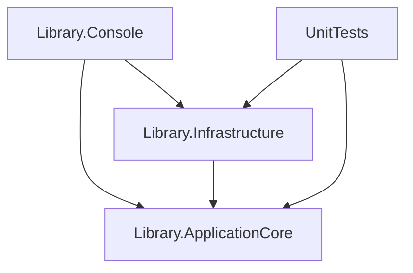
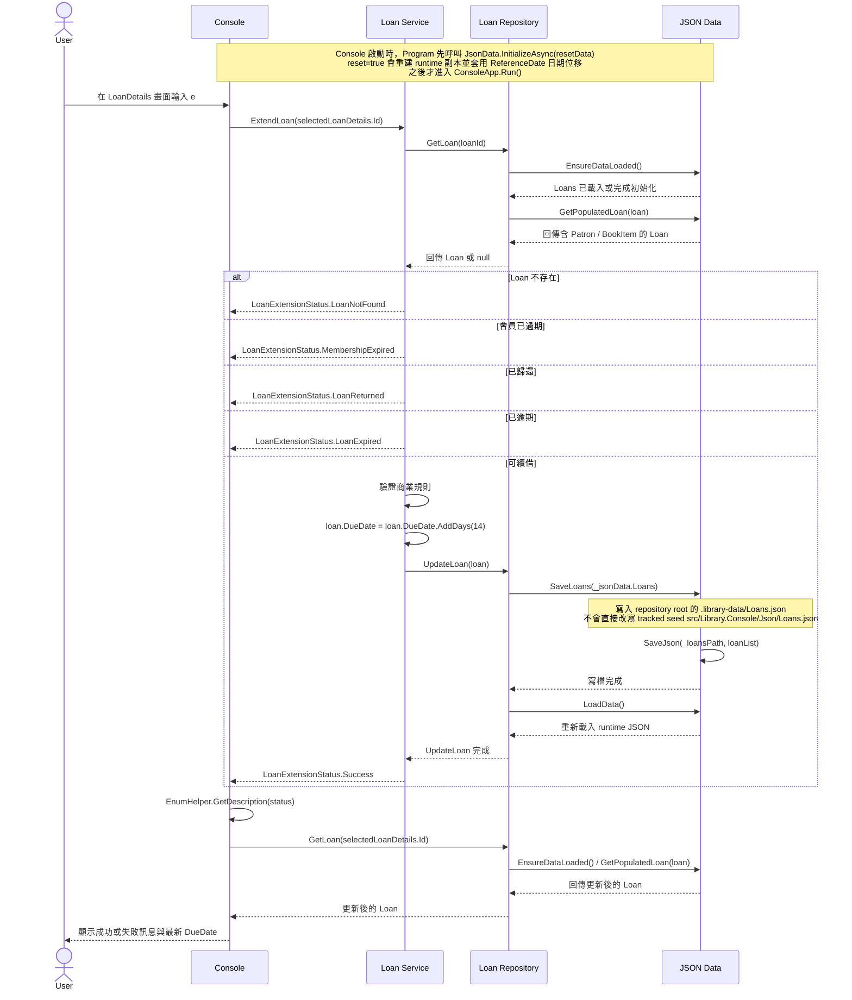
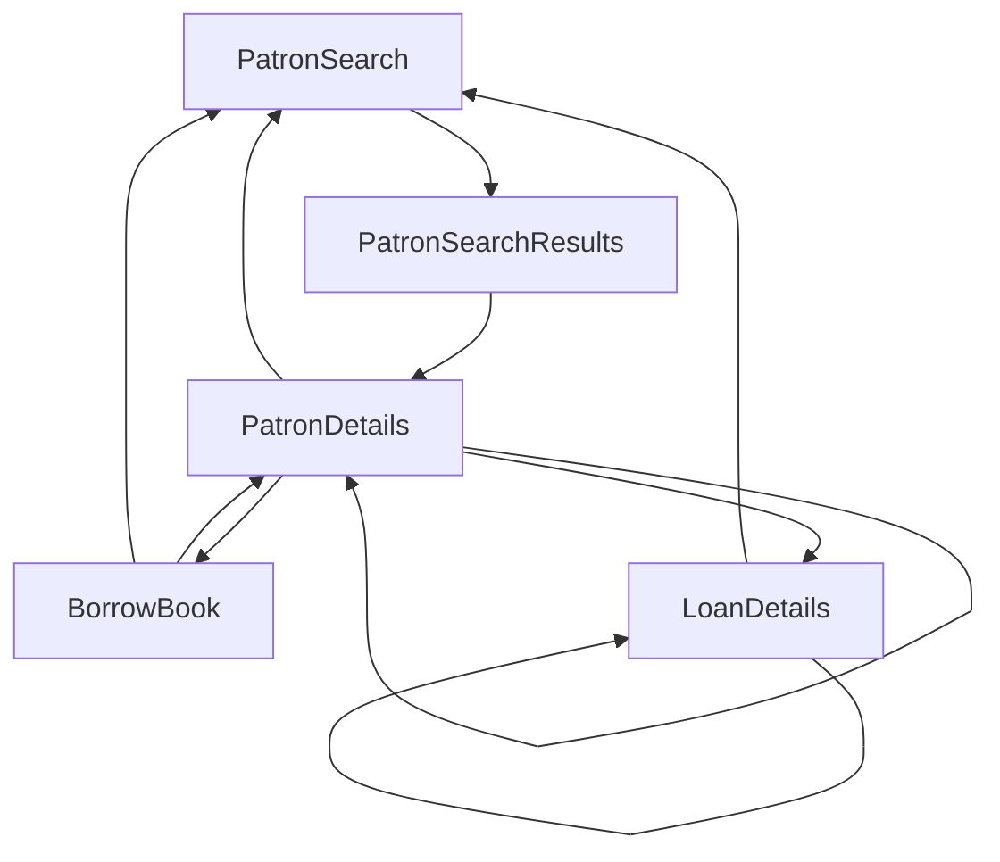

# Repository Overview

本文件只描述目前 Repository 中可由程式碼、測試與 CI 設定直接確認的內容。

- 不將規劃中的功能視為已完成功能。
- 不將課程文件視為系統功能證據。
- 未在程式碼中出現的能力，會標示為目前不存在或無法確認。

## 系統用途

目前可確認這是一個以 Console 為操作介面的圖書館管理練習系統，主要支援以下情境：

- 依讀者姓名查詢讀者
- 查看讀者會員資訊
- 查看讀者借閱清單與單筆借閱明細
- 新增借閱
- 續借書籍
- 歸還書籍
- 會員續期

可以確認的依據：

- Console 入口會註冊讀者與借閱相關的 Repository / Service，然後啟動互動流程。
- Console 可觸發的操作包括搜尋讀者、借書、會員續期、續借、歸還與離開。
- 核心商業邏輯已實作 CreateLoan、ExtendLoan、ReturnLoan、RenewMembership。

## Solution 結構

Solution 為 `AccelerateDevGitHubCopilot.sln`，包含 4 個 Project：

```text
AccelerateDevGitHubCopilot.sln
|- src/
|  |- Library.ApplicationCore
|  |- Library.Infrastructure
|  `- Library.Console
`- tests/
   `- UnitTests
```

目前專案使用 .NET 8。

- `global.json` 固定 SDK 版本為 `8.0.100`
- 所有 `.csproj` 目前 target framework 都是 `net8.0`

## 每個 Project 的責任

### Library.ApplicationCore

負責核心領域模型、商業規則與抽象介面。

包含：

- 領域物件：`Author`、`Book`、`BookItem`、`Loan`、`Patron`
- 抽象介面：`ILoanRepository`、`IPatronRepository`、`ILoanService`、`IPatronService`
- 商業邏輯：`LoanService`、`PatronService`
- 狀態列舉與說明：`LoanCreationStatus`、`LoanExtensionStatus`、`LoanReturnStatus`、`MembershipRenewalStatus`、`EnumHelper`

### Library.Infrastructure

負責 JSON 型資料的初始化、載入、儲存，以及 Repository 實作。

包含：

- `JsonData`：管理 seed data、runtime data、關聯填充與 JSON 存取
- `JsonPatronRepository`：讀者查詢、讀者單筆讀取、讀者更新
- `JsonLoanRepository`：新增借閱、館藏單筆讀取、可借館藏查詢、借閱單筆讀取、借閱更新

### Library.Console

負責 Console 應用程式入口、DI 設定、組態載入與互動式操作流程。

包含：

- `Program`：建立 `ServiceCollection`、讀入 `appSettings.json`、初始化 `JsonData`
- `ConsoleApp`：以狀態機方式處理搜尋、選擇讀者、查看借閱、借書、續借、歸還、會員續期
- `ConsoleState`、`CommonActions`：定義畫面狀態與操作選項

### UnitTests

負責 ApplicationCore 與 Infrastructure 的單元測試。

目前測試重點：

- `LoanService.CreateLoan`
- `LoanService.ExtendLoan`
- `LoanService.ReturnLoan`
- `PatronService.RenewMembership`
- `JsonData.InitializeAsync`
- `JsonLoanRepository` 的新增借閱與可借館藏查詢

## Project 依賴方向



重點：

- `Library.ApplicationCore` 不依賴其他本 Solution Project
- `Library.Infrastructure` 依賴 `Library.ApplicationCore`
- `Library.Console` 依賴 `Library.ApplicationCore` 與 `Library.Infrastructure`
- `UnitTests` 依賴 `Library.ApplicationCore` 與 `Library.Infrastructure`

## 核心領域物件

### Author

- `Id`
- `Name`

### Book

- `Id`
- `Title`
- `AuthorId`
- `Genre`
- `ImageName`
- `ISBN`
- `Author`

### BookItem

- `Id`
- `BookId`
- `AcquisitionDate`
- `Condition`
- `Book`

### Loan

- `Id`
- `BookItemId`
- `PatronId`
- `Patron`
- `LoanDate`
- `DueDate`
- `ReturnDate`
- `BookItem`

### Patron

- `Id`
- `Name`
- `MembershipStart`
- `MembershipEnd`
- `ImageName`
- `Loans`

### 物件關係

- `Patron` 擁有多筆 `Loan`
- `Loan` 指向一位 `Patron`
- `Loan` 指向一個 `BookItem`
- `BookItem` 指向一本 `Book`
- `Book` 指向一位 `Author`

這些關聯不是透過 ORM 建立，而是由 `JsonData` 在載入後以 `GetPopulatedPatron`、`GetPopulatedLoan`、`GetPopulatedBookItem`、`GetPopulatedBook` 動態組裝。

## 目前已實作功能

根據目前可見的 Console 操作、Service 介面、Repository 介面與測試，已實作功能包括：

- 依姓名搜尋讀者
- 顯示符合條件的讀者清單
- 取得單一讀者詳細資訊
- 顯示讀者會員到期日
- 顯示讀者借閱清單
- 顯示單筆借閱明細
- 顯示目前可借館藏清單
- 建立新的借閱紀錄
- 續借書籍
- 歸還書籍
- 會員續期
- 顯示商業規則執行結果訊息
- 以 JSON 檔保存借閱與會員變更

## 讀者查詢流程

讀者查詢流程如下：

1. `Program` 啟動 `ConsoleApp.Run()`。
2. `ConsoleApp` 進入 `PatronSearch` 狀態。
3. 使用者輸入搜尋字串。
4. `IPatronRepository.SearchPatrons(searchInput)` 被呼叫。
5. `JsonPatronRepository.SearchPatrons` 先確保資料已載入，再對 `Patron.Name` 做 `Contains` 比對。
6. 搜尋結果依姓名排序。
7. `JsonData.GetPopulatedPatrons` 為每位讀者補齊借閱、書籍與作者關聯。
8. 若結果數量為 0，顯示找不到資料並回到搜尋。
9. 若結果數量超過 20，要求使用者縮小搜尋範圍。
10. 否則顯示讀者清單並進入 `PatronSearchResults`。
11. 使用者選取讀者後，呼叫 `GetPatron` 載入單一讀者完整資訊並進入 `PatronDetails`。

## 新增借閱流程

目前實際存在的新增借閱流程如下：

1. 使用者先搜尋並選取讀者，進入 `PatronDetails`。
2. 在 `PatronDetails` 畫面輸入 `b`。
3. `ConsoleApp` 進入 `BorrowBook` 狀態，呼叫 `ILoanRepository.GetAvailableBookItems()`。
4. `JsonLoanRepository.GetAvailableBookItems()` 會找出所有 `ReturnDate == null` 的借閱，排除已被借出的 `BookItem`，回傳仍可借的館藏。
5. Console 顯示可借館藏清單，使用者以數字選取一筆館藏。
6. `ConsoleApp` 呼叫 `ILoanService.CreateLoan(patronId, bookItemId)`。
7. `LoanService.CreateLoan()` 依序檢查讀者是否存在、會員是否過期、未歸還借閱是否已達上限 5 筆、館藏是否存在、館藏是否仍可借。
8. 通過規則後，`LoanService` 會建立新的 `Loan` 物件，設定 `LoanDate = DateTime.Now`、`DueDate = LoanDate + 14 天`、`ReturnDate = null`。
9. `JsonLoanRepository.AddLoan()` 會為新借閱指派下一個流水號，將資料加入 runtime `Loans` 集合，寫回 `.library-data/Loans.json`，再重新載入資料。
10. `ConsoleApp` 顯示借閱結果訊息，重新讀取該讀者資料，並回到 `PatronDetails`。

## 續借流程

目前實際存在的續借流程如下。這裡只畫出 Repository 內已存在的 Console、Service、Repository 與 JSON Data 呼叫，不加入不存在的 Web API、Controller、HTTP、Database 或 Message Queue。



對照程式碼，可確認：

1. 續借入口在 `ConsoleApp.LoanDetails()`，使用者輸入 `e` 後呼叫 `_loanService.ExtendLoan(selectedLoanDetails.Id)`。
2. `LoanService.ExtendLoan()` 先用 `ILoanRepository.GetLoan()` 取資料，再依序檢查借閱是否存在、會員是否過期、是否已歸還、是否已逾期。
3. 通過規則後，才把 `DueDate` 往後加 14 天並呼叫 `ILoanRepository.UpdateLoan()`。
4. `JsonLoanRepository.UpdateLoan()` 會更新記憶體中的 `_jsonData.Loans`，再呼叫 `JsonData.SaveLoans()` 寫回 runtime JSON，之後 `LoadData()` 重新載入。
5. 寫入位置是 runtime data 的 `.library-data/Loans.json`；seed 檔 `src/Library.Console/Json/Loans.json` 只作為初始化來源，不是執行中更新目標。
6. `ConsoleApp.LoanDetails()` 在收到狀態後，會印出描述文字，重新讀取借閱資料，再把最新結果顯示回畫面。

## 歸還流程

歸還流程如下：

1. 使用者在 `LoanDetails` 畫面輸入 `r`。
2. `ConsoleApp` 呼叫 `ILoanService.ReturnLoan(loanId)`。
3. `LoanService` 透過 `ILoanRepository.GetLoan(loanId)` 取得借閱。
4. 若找不到借閱，回傳 `LoanNotFound`。
5. 若 `ReturnDate` 已有值，回傳 `AlreadyReturned`。
6. 否則將 `ReturnDate` 設為目前時間。
7. `JsonLoanRepository.UpdateLoan` 將變更寫回 runtime JSON。
8. `ConsoleApp` 顯示狀態說明文字，重新載入該借閱資料，並停留在 `LoanDetails`。

目前看不到逾期罰款、庫存狀態切換或其他後續處理邏輯。

## 會員續期流程

會員續期流程如下：

1. 使用者在 `PatronDetails` 畫面輸入 `m`。
2. `ConsoleApp` 呼叫 `IPatronService.RenewMembership(patronId)`。
3. `PatronService` 透過 `IPatronRepository.GetPatron(patronId)` 取得讀者。
4. 若找不到讀者，回傳 `PatronNotFound`。
5. 若距離會員到期日仍超過 1 個月，回傳 `TooEarlyToRenew`。
6. 若存在任何未歸還且已逾期的借閱，回傳 `LoanNotReturned`。
7. 否則將 `MembershipEnd` 延長 1 年。
8. `JsonPatronRepository.UpdatePatron` 將變更寫回 runtime JSON。
9. `ConsoleApp` 顯示狀態說明文字，重新載入讀者資料，並停留在 `PatronDetails`。

## 新增或修改的 Service

目前可直接確認的 Service 能力如下：

- `LoanService.CreateLoan(patronId, bookItemId)`：新增借閱，並檢查讀者存在、會員有效、同時未歸還借閱上限 5 筆、館藏存在、館藏可借
- `LoanService.ExtendLoan(loanId)`：對未歸還、未逾期且會員仍有效的借閱延長 14 天
- `LoanService.ReturnLoan(loanId)`：將借閱標記為已歸還
- `PatronService.RenewMembership(patronId)`：在到期前 1 個月內，且沒有逾期未還借閱時，將會員資格延長 1 年

可見的借閱相關常數：

- `LoanService.LoanDurationDays = 14`
- `LoanService.ExtendByDays = 14`
- `LoanService.MaxActiveLoans = 5`

## 新增或修改的 Repository 能力

`ILoanRepository` 與 `JsonLoanRepository` 目前支援以下借閱相關能力：

- `AddLoan(Loan loan)`：建立借閱並指派新的流水號
- `GetBookItem(int bookItemId)`：讀取單一館藏與其書籍資訊
- `GetAvailableBookItems()`：回傳所有目前沒有進行中借閱的館藏
- `GetLoan(int loanId)`：讀取單一借閱與其關聯資料
- `UpdateLoan(Loan loan)`：更新借閱到期日或歸還日期

`IPatronRepository` 與 `JsonPatronRepository` 則維持以下能力：

- `SearchPatrons(string searchInput)`：以姓名片段查詢讀者
- `GetPatron(int id)`：讀取單一讀者與其借閱資訊
- `UpdatePatron(Patron patron)`：更新會員資料

## 資料存取方式

### Seed data 與 runtime data

系統目前使用 JSON 檔作為資料來源與儲存媒介，並區分為兩層：

- Seed data：由 `JsonPaths` 設定指定，目前來源為 `src/Library.Console/Json` 內的 JSON 檔
- Runtime data：由 `JsonData:RuntimeRoot` 指定，預設值為 `.library-data`

`JsonData` 啟動時會：

1. 解析 seed data 路徑
2. 將 runtime root 解析成目前工作目錄下的實際路徑
3. 依 seed 檔名建立對應的 runtime 檔路徑
4. 首次執行時把 seed data 複製到 runtime data
5. 依 `ReferenceDate` 對日期欄位做平移，讓教學資料相對於當前日期保持可用

### 初始化規則

- `InitializeAsync(resetData: false)`：若 runtime data 不存在，則建立；若完整存在，則直接載入；若只存在部分檔案，則丟出例外
- `InitializeAsync(resetData: true)`：刪除現有 runtime 檔案後，以 seed data 重新建立

### 實際讀寫方式

- `LoadData()` 從 runtime JSON 載入 `Authors`、`Books`、`BookItems`、`Patrons`、`Loans`
- `AddLoan()` 會將新借閱加入 `_jsonData.Loans`，寫回 `Loans.json`，再重新載入資料
- `SaveLoans()` 只將 `Loan` 的持久化欄位寫回 `Loans.json`
- `SavePatrons()` 只將 `Patron` 的持久化欄位寫回 `Patrons.json`
- `GetAvailableBookItems()` 不是讀取獨立的可借旗標，而是以 `Loans` 中 `ReturnDate == null` 的借閱推導目前不可借館藏
- `JsonPatronRepository` 與 `JsonLoanRepository` 更新後都會重新載入資料

### 關聯填充

由於 JSON 檔本身主要保存 ID 與基本欄位，`JsonData` 會在讀取後補齊：

- `Patron -> Loans`
- `Loan -> BookItem`
- `Loan -> Patron`
- `BookItem -> Book`
- `Book -> Author`

## JSON 儲存變更

新增借閱功能上線後，JSON 儲存層目前有以下可確認變更：

- 借閱資料不再只是更新既有 `Loan`，也會新增新的 `Loan` 記錄
- 新借閱 ID 由 `JsonLoanRepository.AddLoan()` 以目前最大 `Loan.Id + 1` 產生
- 館藏可借狀態不是持久化欄位，而是依 runtime `Loans.json` 中是否存在未歸還借閱動態推導
- 借閱、續借、歸還都只會寫入 runtime data `.library-data/Loans.json`
- 會員續期只會寫入 runtime data `.library-data/Patrons.json`
- tracked seed `src/Library.Console/Json` 不會在執行期間被直接改寫

## Console 新增操作

相較於原先只有搜尋、續期、續借、歸還的流程，Console 目前新增了借書操作：

- `CommonActions.BorrowBook`
- `ConsoleState.BorrowBook`
- 在 `PatronDetails` 畫面輸入 `b` 可以進入借書流程
- `BorrowBook` 畫面會列出所有目前可借的館藏，並允許使用數字選取
- 借閱成功或失敗後，畫面會回到目前讀者的 `PatronDetails`

## Console 操作流程

Console 目前可視為一個簡單的狀態機：



對應狀態如下：

- `PatronSearch`：輸入姓名搜尋字串
- `PatronSearchResults`：顯示讀者清單並選擇讀者
- `PatronDetails`：顯示會員資訊與借閱清單，可續期會員或進入借書流程
- `BorrowBook`：顯示可借館藏清單並建立借閱
- `LoanDetails`：顯示單筆借閱資訊，可續借或歸還
- `Quit`：離開程式

操作選項如下：

- 輸入數字：選取清單項目
- `s`：重新搜尋讀者
- `b`：借書
- `m`：會員續期
- `e`：續借
- `r`：歸還
- `q`：離開

## 測試結構

目前測試專案為 `tests/UnitTests`，使用：

- xUnit
- NSubstitute
- Microsoft.NET.Test.Sdk
- coverlet.collector

### ApplicationCore 測試

`LoanService.CreateLoan` 測試涵蓋：

- 讀者不存在
- 會員已過期
- 無進行中借閱時可成功借閱
- 已有 4 筆進行中借閱時仍可建立第 5 筆借閱
- 已有 5 筆進行中借閱時不可再借
- 已歸還借閱不計入上限
- 館藏不存在
- 館藏已被借出
- 被拒絕的借閱請求不會建立借閱紀錄
- 被拒絕的借閱請求不會改變讀者現有借閱狀態
- 成功借閱時會正確填入新借閱欄位
- 儲存失敗時回傳錯誤

`LoanService.ExtendLoan` 測試涵蓋：

- 續借成功
- 借閱不存在
- 會員已過期
- 借閱已歸還
- 借閱已逾期
- 儲存失敗時回傳錯誤

`LoanService.ReturnLoan` 測試涵蓋：

- 借閱不存在
- 借閱已歸還
- 一般借閱歸還成功
- 逾期借閱歸還成功
- 過期會員的借閱歸還成功
- 儲存失敗時回傳錯誤

`PatronService.RenewMembership` 測試涵蓋：

- 無借閱時續期成功
- 會員已過期時續期成功
- 只有已歸還借閱時續期成功
- 只有未逾期借閱時續期成功
- 讀者不存在
- 太早續期
- 有逾期未還借閱時不可續期

### Infrastructure 測試

`JsonDataTests` 目前涵蓋：

- 首次初始化會建立 runtime data
- 初始化後資料筆數與關鍵教學資料分布正確
- 已有 runtime 變更時，重新初始化不會覆蓋變更
- 指定 reset 時會還原回 seed data
- runtime data 只有部分檔案時會拒絕載入並要求 reset

`JsonLoanRepositoryTests` 目前涵蓋：

- `GetAvailableBookItems()` 只回傳沒有進行中借閱的館藏
- `AddLoan()` 會指派下一個 ID、寫入新借閱，並讓該館藏從可借清單中消失

### 目前測試總數

目前程式碼中可見的 `[Fact]` 測試共有 37 個。

## 新增測試

這一輪借閱功能擴充後，至少可直接確認新增了以下測試面向：

- `tests/UnitTests/ApplicationCore/LoanService/CreateLoan.cs`：完整覆蓋新增借閱的成功與失敗分支
- `tests/UnitTests/Infrastructure/JsonLoanRepositoryTests.cs`：驗證可借館藏推導與新增借閱後的 JSON 寫入效果

## 已知限制

- 目前只有 Console 操作介面，沒有 Web API、資料庫或前端網站
- 借書流程必須先選取讀者，不能直接輸入讀者 ID 與館藏 ID 完成借閱
- 讀者搜尋目前以 `Patron.Name.Contains(...)` 比對，是否應大小寫不敏感仍未在程式中明示
- 館藏可借狀態完全由未歸還借閱推導，沒有獨立的館藏狀態欄位
- runtime data 寫入使用本機 JSON 檔，未見多人同時操作、檔案鎖定或衝突處理機制
- `.library-data` 的解析依賴執行時工作目錄，若不從 Repository root 執行，實際位置可能不同

## CI 流程

目前只有一個 GitHub Actions workflow：`Build and Test`。

觸發條件：

- `pull_request` 到 `main`

執行內容：

1. Checkout Repository
2. 安裝 .NET 8.x
3. `dotnet restore`
4. `dotnet build --configuration Release`
5. `dotnet test --configuration Release --no-build`

目前沒有看到以下驗證：

- Lint
- Format 檢查
- Coverage 上傳或門檻
- Security scan
- 多版本 .NET matrix

## 目前不存在的功能

以下功能目前沒有在程式碼、介面、Console 操作、測試或 CI 中看到實作證據，因此不應視為已完成：

- 書籍搜尋
- 書籍清單查詢
- 新增或編輯館藏
- 預約 / 保留書籍
- 罰款或逾期費計算
- Web API
- Controller
- 資料庫存取
- ORM
- 前端網站或 SPA
- 身分驗證 / 授權
- 背景工作

其中某些功能未來是否會實作：本文件無法確認。

## 尚待確認事項

以下項目目前無法只靠現有程式碼明確確認：

- 這個系統是否有正式的業務需求文件或規格文件
- `JsonPatronRepository.SearchPatrons` 是否需要大小寫不敏感搜尋，目前實作未明示
- 借閱、會員續期與續借規則是否為最終規格，或僅為目前 lab 階段的最小實作
- `.library-data` 的實際使用位置是否總是 Repository root；程式邏輯是以目前工作目錄解析
- 是否需要處理多人同時操作、檔案鎖定或並行寫入
- 是否需要處理書籍可借狀態、損壞狀態、罰款、借閱上限等更完整館務規則

## 目前可直接參考的關鍵檔案

- `AccelerateDevGitHubCopilot.sln`
- `global.json`
- `src/Library.Console/Program.cs`
- `src/Library.Console/ConsoleApp.cs`
- `src/Library.ApplicationCore/Interfaces/ILoanRepository.cs`
- `src/Library.ApplicationCore/Services/LoanService.cs`
- `src/Library.ApplicationCore/Services/PatronService.cs`
- `src/Library.Infrastructure/Data/JsonData.cs`
- `src/Library.Infrastructure/Data/JsonPatronRepository.cs`
- `src/Library.Infrastructure/Data/JsonLoanRepository.cs`
- `tests/UnitTests/ApplicationCore/LoanService/CreateLoan.cs`
- `tests/UnitTests/ApplicationCore/LoanService/ExtendLoan.cs`
- `tests/UnitTests/ApplicationCore/LoanService/ReturnLoan.cs`
- `tests/UnitTests/ApplicationCore/PatronService/RenewMembership.cs`
- `tests/UnitTests/Infrastructure/JsonDataTests.cs`
- `tests/UnitTests/Infrastructure/JsonLoanRepositoryTests.cs`
- `.github/workflows/build-test.yml`
